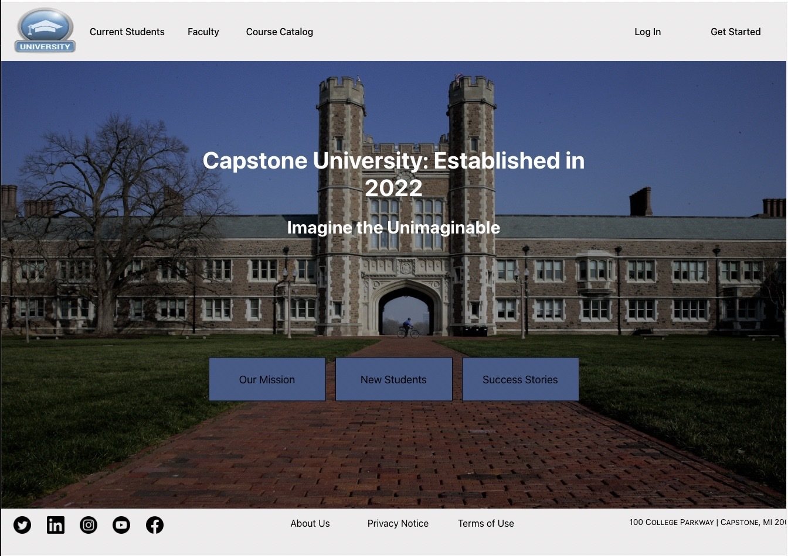

# Capstone University 

## About 
>Capstone University is a project I developed to learn multiple relevant skills such as React.js, Django, and SQL which I did not have a great understanding of. This project was originally a project I had eight weeks to build in a collaborative setting, mimicking a professonial environment. I decided afterwards to rewrite the whole project to match the vision I had for it. Developing a full-stack web app has been a very rewarding experience and has taught me how intricate web development can be, something I no longer take for granted.

## Features
The website represents a fictious University and implements many features that a traditional University website would have.

- Deploys a responsive frontend in React and backend in Django.
- Create an account as a student or faculty member, allowing access to different permissions and pages.
- Implements custom user authentication & CSRF token protection.
- *Student* permissions include being able to view, register, and drop courses. Students have a feed page separate from faculty.
- *Faculty* permissions include being able to create and delete courses, as well as viewing courses the faculty user is responsible for.
- Custom dashboard shows current user information as well as courses registered for students and courses taught for faculty.
- The course catalog page stores information of courses created by faculty members including course name, date, and room. Database also stores crucial information such as students registered for the course and the professor.
 

## Usage
The site is currently hosted on Heroku. Find it [here](https://capstone-university-d2000131f462.herokuapp.com/home). 

## Planned Updates
- A revamped faculty feed to differentiate the page from the student page.
- Adding more advanced CSS concepts to make the site more visually appealing.
- Adding an "About Us" and "Success Stories" page.
